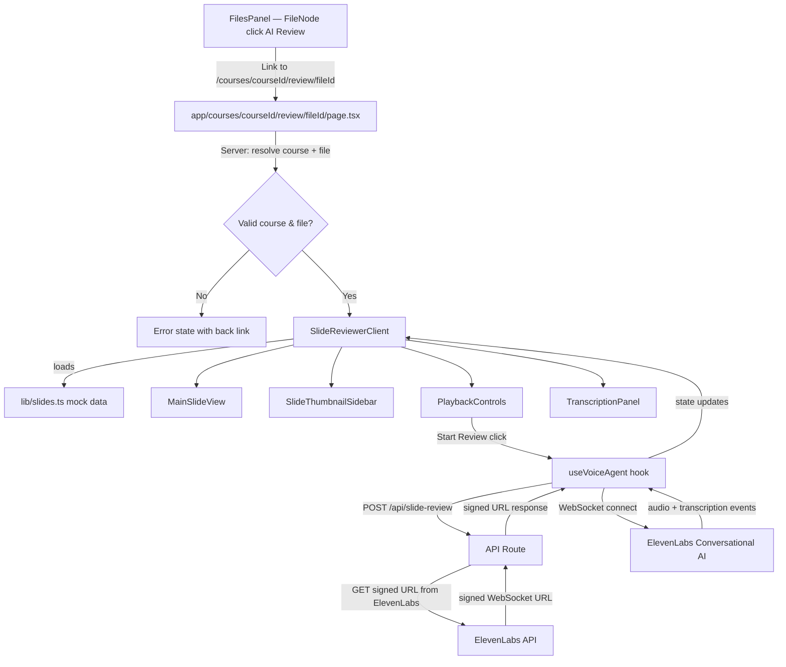

# Design Document — AI Slide Reviewer

## Overview

The AI Slide Reviewer adds a voice-powered slide briefing experience to the CanvasAI platform. Students can launch an "AI Review" from any PPT, PPTX, or PDF file in the course Files tab, which opens a dedicated viewer page at `/courses/[courseId]/review/[fileId]`. An ElevenLabs Conversational AI voice agent narrates each slide in 30–60 seconds, auto-advances through the deck, and allows the student to interrupt with spoken questions. A real-time transcription panel displays the conversation, and playback controls let the student pause, resume, or stop the session.

The feature introduces:
- An **AI Review button** on eligible file rows in the existing `FileNode` component
- A new **Slide Reviewer page** with main slide view, thumbnail sidebar, transcription panel, and playback controls
- A **mock slide data module** (`lib/slides.ts`) providing simulated slide content per file
- A **Next.js API route** (`/api/slide-review`) that securely obtains a signed WebSocket URL from ElevenLabs, keeping the API key server-side
- A **client-side voice agent hook** (`useVoiceAgent`) that manages the WebSocket connection, audio streaming, transcription state, and slide auto-advance logic

No actual file parsing is required — all slide content comes from mock data. The ElevenLabs integration uses the Conversational AI WebSocket protocol with signed URLs for authentication.

---

## Architecture

The feature follows the existing Next.js App Router conventions. The page is a server component that resolves the course and file, then renders a client component for the interactive slide viewer.

```
app/
  courses/
    [courseId]/
      review/
        [fileId]/
          page.tsx              ← Server component; resolves course + file, renders SlideReviewer
  api/
    slide-review/
      route.ts                  ← POST handler; returns signed WebSocket URL from ElevenLabs

components/
  course-detail/
    FileNode.tsx                ← Modified: adds AI Review button on eligible files
  slide-reviewer/
    SlideReviewerClient.tsx     ← Main client component; orchestrates all sub-components
    MainSlideView.tsx           ← Renders the current slide content (title, bullets, image placeholder)
    SlideThumbnailSidebar.tsx   ← Scrollable vertical list of slide thumbnails
    TranscriptionPanel.tsx      ← Real-time transcription display with auto-scroll
    PlaybackControls.tsx        ← Play/Pause/Stop toolbar with visual audio indicator

hooks/
  useVoiceAgent.ts              ← Custom hook: manages ElevenLabs WebSocket, audio, transcription state

lib/
  slides.ts                     ← Mock slide data keyed by file ID
  courses.ts                    ← Unchanged (CourseFileNode type already sufficient)
```

### Data Flow



### ElevenLabs Integration Architecture

The integration uses the **signed URL** pattern recommended by ElevenLabs:

1. **Client** calls `POST /api/slide-review` with the agent ID and slide content context
2. **API route** reads `ELEVENLABS_API_KEY` from env, calls the ElevenLabs `get_signed_url` endpoint
3. **API route** returns the signed WebSocket URL to the client (valid for 15 minutes)
4. **Client** opens a WebSocket to the signed URL, streams microphone audio, and receives agent audio + transcription events
5. When a slide narration completes, the client sends updated slide context and auto-advances

For the **mock/demo implementation**, the `useVoiceAgent` hook includes a fallback mode: if the ElevenLabs API is unavailable or the key is not configured, it simulates narration using the browser's built-in `SpeechSynthesis` API and generates mock transcription text from the slide content. This allows the full UI to function without an active ElevenLabs account.

---

## Components and Interfaces

### `app/courses/[courseId]/review/[fileId]/page.tsx` (Server Component)

```ts
type Props = {
  params: Promise<{ courseId: string; fileId: string }>;
};
```

- Resolves `courseId` from `courses` array in `lib/courses.ts`
- Recursively searches the course's `files` tree to find the file node matching `fileId`
- If course or file not found: renders error state with back link
- If file found but not an eligible type (ppt/pptx/pdf): renders error state
- If valid: renders `<SlideReviewerClient>` with course name, file name, file ID, and slide data

### `components/course-detail/FileNode.tsx` (Modified)

Changes:
- Import `Link` from `next/link` and `SparkleIcon` from Phosphor
- Accept a new `courseId` prop (passed down from `FilesPanel`)
- After the file metadata span, conditionally render the AI Review button for files with `.ppt`, `.pptx`, or `.pdf` extensions
- Button: `<Link>` styled as a pill (`rounded-full px-2.5 py-1 text-[11.5px] font-medium`) with brand color, Phosphor `SparkleIcon`, and label "AI Review"
- `onClick` on the link calls `e.stopPropagation()` to prevent the parent row's click handler from firing

```ts
type FileNodeProps = {
  node: CourseFileNode;
  depth: number;
  expanded: Set<string>;
  onToggle: (id: string) => void;
  courseId: string; // NEW
};
```

### `components/slide-reviewer/SlideReviewerClient.tsx` (Client Component)

```ts
type SlideReviewerClientProps = {
  courseName: string;
  fileName: string;
  fileId: string;
  slides: SlideData[];
};
```

- Manages `currentSlideIndex` state
- Instantiates `useVoiceAgent` hook
- Renders the page layout: header with back link + file/course name, then a two-column grid (main slide + sidebar), then playback controls bar, then transcription panel
- Handles keyboard navigation (ArrowLeft/ArrowRight) via a `useEffect` with `keydown` listener
- When the voice agent signals slide completion, increments `currentSlideIndex` and sends new slide context

### `components/slide-reviewer/MainSlideView.tsx`

```ts
type MainSlideViewProps = {
  slide: SlideData;
  slideIndex: number;
  totalSlides: number;
};
```

- Renders the slide title as an `<h2>`, bullet points as a `<ul>`, and an image placeholder `<div>` when `slide.hasImage` is true
- Displays "Slide X of Y" indicator using `aria-live="polite"`
- Card styling: `bg-surface border border-ink-border rounded-2xl shadow-card p-8`

### `components/slide-reviewer/SlideThumbnailSidebar.tsx`

```ts
type SlideThumbnailSidebarProps = {
  slides: SlideData[];
  currentIndex: number;
  narratingIndex: number | null;
  onSelectSlide: (index: number) => void;
};
```

- Renders a scrollable `<nav>` with `role="list"` containing thumbnail cards
- Each thumbnail shows a miniature version of the slide (title + first bullet truncated)
- Active slide has a `border-[var(--brand)]` highlight
- Narrating slide shows a pulsing animation (`animate-pulse`) on a small dot indicator
- Clicking a thumbnail calls `onSelectSlide(index)`
- Auto-scrolls the active thumbnail into view using `scrollIntoView`

### `components/slide-reviewer/TranscriptionPanel.tsx`

```ts
type TranscriptionEntry = {
  id: string;
  speaker: "agent" | "student";
  text: string;
  slideIndex: number;
  timestamp: number;
};

type TranscriptionPanelProps = {
  entries: TranscriptionEntry[];
  currentSlideIndex: number;
};
```

- Fixed max height (`max-h-[200px]`) with `overflow-y-auto`
- Uses `aria-live="polite"` and `role="log"` for screen reader announcements
- Groups entries by slide with a heading divider ("Slide X") when the slide index changes
- Agent text styled in default ink color; student text styled with `text-[var(--brand)]` and prefixed with "You:"
- Auto-scrolls to bottom on new entries using a `useEffect` with a ref

### `components/slide-reviewer/PlaybackControls.tsx`

```ts
type PlaybackControlsProps = {
  status: "idle" | "playing" | "paused" | "stopped";
  onStart: () => void;
  onPause: () => void;
  onResume: () => void;
  onStop: () => void;
};
```

- Renders a horizontal toolbar between the main slide view and transcription panel
- `idle` / `stopped` state: "Start Review" button (brand-colored pill with `SparkleIcon`)
- `playing` state: Pause button (`PauseIcon`) + Stop button (`StopIcon`) + animated waveform indicator
- `paused` state: Play button (`PlayIcon`) + Stop button (`StopIcon`)
- All buttons have `aria-label` attributes and are keyboard-focusable
- Waveform indicator: three small bars with staggered CSS animation

### `hooks/useVoiceAgent.ts`

```ts
type VoiceAgentState = {
  status: "idle" | "connecting" | "playing" | "paused" | "stopped" | "error";
  transcription: TranscriptionEntry[];
  currentNarratingIndex: number | null;
  error: string | null;
  micPermission: "prompt" | "granted" | "denied";
};

type UseVoiceAgentReturn = {
  state: VoiceAgentState;
  startSession: (slideIndex: number, slideContent: SlideData) => Promise<void>;
  pauseSession: () => void;
  resumeSession: () => void;
  stopSession: () => void;
  navigateToSlide: (index: number, slideContent: SlideData) => void;
};
```

- On `startSession`: requests microphone permission, calls `POST /api/slide-review` to get signed URL, opens WebSocket
- Handles WebSocket events: `user_transcript`, `agent_response`, `audio`, `interruption`, `ping`
- Manages audio playback using `AudioContext` and queued audio chunks
- On `pauseSession`: suspends `AudioContext`, pauses WebSocket message processing
- On `resumeSession`: resumes `AudioContext` and message processing
- On `stopSession`: closes WebSocket, stops microphone stream, resets state
- **Fallback mode**: if API returns 503 (no key configured), uses `SpeechSynthesis` to read slide content aloud and generates transcription entries from the slide text
- Exposes `navigateToSlide` to interrupt current narration and start narrating a new slide

### `app/api/slide-review/route.ts`

```ts
// POST body
type SlideReviewRequest = {
  agentId?: string;
  slideContent: {
    title: string;
    bullets: string[];
  };
};

// Response
type SlideReviewResponse = {
  signedUrl: string;
} | {
  error: string;
};
```

- Reads `ELEVENLABS_API_KEY` from `process.env`
- If key missing: returns `{ error: "ElevenLabs API key not configured" }` with status 503
- Calls `GET https://api.elevenlabs.io/v1/convai/conversation/get_signed_url?agent_id={agentId}` with `xi-api-key` header
- Returns `{ signedUrl }` on success
- Returns `{ error }` with appropriate status on failure

---

## Data Models

### `SlideData` type (new, in `lib/slides.ts`)

```ts
export type SlideData = {
  title: string;
  bullets: string[];
  hasImage: boolean;
};

export type FileSlideSet = {
  fileId: string;
  slides: SlideData[];
};
```

### Mock slide data (in `lib/slides.ts`)

A `Map<string, SlideData[]>` or exported object keyed by file ID. Provides mock slides for each eligible file in the existing course data:

- `file-lec01` (Lecture 01 — Arrays & Complexity.pdf): 5 slides covering arrays, Big-O, time complexity, space complexity, summary
- `file-lec02` (Lecture 02 — Linked Lists.pdf): 5 slides covering singly linked lists, doubly linked lists, operations, comparison with arrays, summary
- `file-lec03` (Lecture 03 — Trees & Heaps.pptx): 5 slides covering binary trees, BST operations, heaps, heap sort, summary
- `file-ps1` through `file-ps4` (Problem Sets): 4 slides each with problem descriptions and hints
- `des-file-lec01` through `des-file-lec04` (Design course lectures): 4–5 slides each
- `des-file-syllabus`, `des-file-brand-examples`, `des-file-a1-brief`, `des-file-a2-brief`: 4 slides each

Each slide has a `title` (string), `bullets` (array of 3–5 strings), and `hasImage` (boolean, true for ~40% of slides to show image placeholders).

### `TranscriptionEntry` type (in `hooks/useVoiceAgent.ts` or `lib/types.ts`)

```ts
export type TranscriptionEntry = {
  id: string;           // unique ID (crypto.randomUUID or counter)
  speaker: "agent" | "student";
  text: string;
  slideIndex: number;   // which slide this entry belongs to
  timestamp: number;    // Date.now() when received
};
```

### Helper: `isEligibleForReview`

```ts
// lib/slides.ts
export function isEligibleForReview(fileName: string): boolean {
  const ext = fileName.split(".").pop()?.toLowerCase() ?? "";
  return ["ppt", "pptx", "pdf"].includes(ext);
}
```

### Helper: `findFileNode`

```ts
// lib/slides.ts
export function findFileNode(
  nodes: CourseFileNode[],
  fileId: string
): CourseFileNode | undefined {
  for (const node of nodes) {
    if (node.id === fileId) return node;
    if (node.children) {
      const found = findFileNode(node.children, fileId);
      if (found) return found;
    }
  }
  return undefined;
}
```


---

## Correctness Properties

*A property is a characteristic or behavior that should hold true across all valid executions of a system — essentially, a formal statement about what the system should do. Properties serve as the bridge between human-readable specifications and machine-verifiable correctness guarantees.*

The project currently has no test framework. The Testing Strategy section below specifies how to set up **Vitest** with **fast-check** for property-based testing and **@testing-library/react** for component rendering.

---

### Property 1: File eligibility check

*For any* file name string, `isEligibleForReview` SHALL return `true` if and only if the file extension (case-insensitive) is one of `ppt`, `pptx`, or `pdf`, and SHALL return `false` for all other extensions including empty strings and names with no extension.

**Validates: Requirements 1.1, 1.2**

---

### Property 2: AI Review link href construction

*For any* valid course ID and file ID strings, the AI Review button rendered in `FileNode` for an eligible file SHALL contain a link with `href` equal to `/courses/{courseId}/review/{fileId}`.

**Validates: Requirements 1.3**

---

### Property 3: Main slide view renders slide content and position

*For any* valid `SlideData` object (with non-empty title and bullets array) and any slide index `i` in range `[0, total)`, the rendered `MainSlideView` SHALL contain the slide title, all bullet point texts, and the string `"Slide {i+1} of {total}"`.

**Validates: Requirements 2.2, 9.4**

---

### Property 4: Slide thumbnail sidebar renders all slides

*For any* non-empty array of `SlideData` objects, the rendered `SlideThumbnailSidebar` SHALL contain exactly as many thumbnail elements as there are slides in the array.

**Validates: Requirements 2.3**

---

### Property 5: Thumbnail click dispatches correct index

*For any* array of slides and any valid index `i` within that array, clicking the thumbnail at position `i` in `SlideThumbnailSidebar` SHALL call `onSelectSlide` with the argument `i`.

**Validates: Requirements 2.4**

---

### Property 6: Selected thumbnail highlighting

*For any* array of slides and any valid `currentIndex`, exactly one thumbnail in `SlideThumbnailSidebar` SHALL have the brand-colored border highlight, and it SHALL be the thumbnail at position `currentIndex`.

**Validates: Requirements 2.5**

---

### Property 7: Header displays course and file names

*For any* non-empty course name and file name strings, the rendered `SlideReviewerClient` header SHALL contain both the course name and the file name.

**Validates: Requirements 2.7**

---

### Property 8: Mock data structure invariants

*For any* file entry in the mock slide data, the entry SHALL contain at least 4 slides, and each slide SHALL have a non-empty `title` string, a non-empty `bullets` array of strings, and a `hasImage` boolean field.

**Validates: Requirements 3.1, 3.2**

---

### Property 9: Slide data lookup correctness

*For any* file ID that exists as a key in the mock slide data, calling the slide lookup function with that file ID SHALL return the corresponding `SlideData[]` array, and the returned array SHALL be identical to the stored data.

**Validates: Requirements 3.3**

---

### Property 10: Auto-advance on narration completion

*For any* slide array of length `N` and any current slide index `i` where `0 ≤ i < N-1`, when the voice agent signals narration completion, the current slide index SHALL advance to `i+1`. When `i = N-1` (last slide), the session status SHALL transition to `"stopped"`.

**Validates: Requirements 4.4, 4.5**

---

### Property 11: Narrating thumbnail indicator

*For any* array of slides and any valid `narratingIndex`, exactly one thumbnail in `SlideThumbnailSidebar` SHALL display the pulsing narration indicator, and it SHALL be the thumbnail at position `narratingIndex`. When `narratingIndex` is `null`, no thumbnail SHALL display the indicator.

**Validates: Requirements 4.6**

---

### Property 12: Transcription entries render with speaker-differentiated styling

*For any* non-empty array of `TranscriptionEntry` objects, the rendered `TranscriptionPanel` SHALL contain the text of every entry, and entries with `speaker: "agent"` SHALL have different CSS styling than entries with `speaker: "student"`.

**Validates: Requirements 6.1, 6.4**

---

### Property 13: Slide heading dividers in transcription

*For any* array of `TranscriptionEntry` objects that spans `K` distinct `slideIndex` values (where `K > 1`), the rendered `TranscriptionPanel` SHALL contain exactly `K` slide heading dividers, one for each distinct slide index.

**Validates: Requirements 6.3**

---

### Property 14: Playback controls status-to-UI mapping

*For any* playback status value, the rendered `PlaybackControls` SHALL display the correct buttons: `"idle"` and `"stopped"` show a "Start Review" button; `"playing"` shows Pause, Stop, and an animated waveform indicator; `"paused"` shows Play and Stop buttons. No other button combinations SHALL appear.

**Validates: Requirements 7.1, 7.2, 7.3, 7.4, 7.6**

---

### Property 15: Keyboard navigation with boundary clamping

*For any* slide array of length `N` and any current index `i`, pressing ArrowRight SHALL set the index to `min(i+1, N-1)` and pressing ArrowLeft SHALL set the index to `max(i-1, 0)`.

**Validates: Requirements 8.3**

---

### Property 16: API route error response structure

*For any* error scenario (ElevenLabs API returning 4xx/5xx, network failure, or missing API key), the `/api/slide-review` route SHALL return a JSON response with an `error` string field and an appropriate HTTP status code (4xx or 5xx).

**Validates: Requirements 10.4, 10.5**

---

## Error Handling

| Scenario | Handling |
|---|---|
| Unknown `courseId` in URL | `page.tsx` renders a centered error message ("Course not found") with a `<Link href="/">` back to courses. |
| Unknown `fileId` in URL | `page.tsx` renders an error message ("File not found") with a `<Link href={/courses/${courseId}}>` back to the course page. |
| File is not eligible type | `page.tsx` renders an error message ("This file type does not support AI Review") with a back link. |
| `fileId` has no mock slide data | `SlideReviewerClient` renders an error state ("No slide data available for this file") with a back link. |
| `ELEVENLABS_API_KEY` not set | API route returns `503 { error: "ElevenLabs API key not configured" }`. Client falls back to `SpeechSynthesis` mode. |
| ElevenLabs API returns error | API route returns the error status and message. Client shows a toast/banner: "Voice agent unavailable — using text-to-speech fallback." |
| ElevenLabs WebSocket disconnects | `useVoiceAgent` sets status to `"error"`, displays reconnection message, allows retry. |
| Microphone permission denied | `useVoiceAgent` sets `micPermission: "denied"`, UI shows explanation message and offers listen-only mode (narration without student interruption). |
| Browser does not support `SpeechSynthesis` | Fallback mode shows transcription text only without audio. Playback controls still advance slides on a timer. |
| Empty slide bullets array | `MainSlideView` renders the title and image placeholder but omits the bullet list. |
| Keyboard navigation at boundaries | ArrowRight at last slide and ArrowLeft at first slide are no-ops (index clamped). |

---

## Testing Strategy

### Framework Setup

The project has no test framework. Add **Vitest** with **@testing-library/react** and **fast-check**:

```bash
npm install --save-dev vitest @vitejs/plugin-react @testing-library/react @testing-library/jest-dom @testing-library/user-event jsdom fast-check
```

Add a `vitest.config.ts` at the project root:

```ts
import { defineConfig } from "vitest/config";
import react from "@vitejs/plugin-react";
import path from "path";

export default defineConfig({
  plugins: [react()],
  test: {
    environment: "jsdom",
    setupFiles: ["./setupTests.ts"],
    globals: true,
  },
  resolve: {
    alias: {
      "@": path.resolve(__dirname, "."),
    },
  },
});
```

Add a `setupTests.ts`:

```ts
import "@testing-library/jest-dom/vitest";
```

Add a test script to `package.json`:

```json
"test": "vitest --run"
```

### Property-Based Tests (fast-check)

Each property test uses `fc.assert(fc.property(...))` with a minimum of **100 iterations**.

Tag format: `// Feature: ai-slide-reviewer, Property {N}: {property_text}`

| Property | Generator | Assertion |
|---|---|---|
| P1: File eligibility | `fc.tuple(fc.stringOf(fc.constantFrom(...alphanumChars)), fc.constantFrom("ppt","pptx","pdf","doc","zip","txt","","jpg"))` | `isEligibleForReview` returns true iff extension is ppt/pptx/pdf |
| P2: Link href | `fc.record({ courseId: fc.hexaString(), fileId: fc.hexaString() })` | Rendered link href matches `/courses/{courseId}/review/{fileId}` |
| P3: Slide content + position | `fc.record({ title: fc.string({minLength:1}), bullets: fc.array(fc.string({minLength:1}),{minLength:1}), hasImage: fc.boolean() }), fc.nat()` | Title, all bullets, and "Slide X of Y" present in rendered output |
| P4: Thumbnail count | `fc.array(slideDataArb, {minLength:1, maxLength:20})` | Number of thumbnail elements equals array length |
| P5: Thumbnail click index | `fc.array(slideDataArb, {minLength:1}), fc.nat()` | `onSelectSlide` called with clicked index |
| P6: Selected highlight | `fc.array(slideDataArb, {minLength:1}), fc.nat()` | Exactly one thumbnail has brand border at `currentIndex` |
| P7: Header names | `fc.record({ courseName: fc.string({minLength:1}), fileName: fc.string({minLength:1}) })` | Both strings present in rendered header |
| P8: Mock data invariants | Iterate all entries in mock data | Each entry has ≥4 slides, each slide has valid fields |
| P9: Slide lookup | `fc.constantFrom(...Object.keys(mockSlideData))` | Lookup returns correct data |
| P10: Auto-advance | `fc.nat({max:19}), fc.integer({min:2, max:20})` | Index advances or session stops at last slide |
| P11: Narrating indicator | `fc.array(slideDataArb, {minLength:1}), fc.option(fc.nat())` | Exactly one or zero pulsing indicators at correct position |
| P12: Transcription rendering | `fc.array(transcriptionEntryArb, {minLength:1})` | All texts present, agent/student have different classes |
| P13: Slide dividers | `fc.array(transcriptionEntryArb, {minLength:2})` with multiple slideIndex values | Correct number of dividers |
| P14: Playback controls | `fc.constantFrom("idle","playing","paused","stopped")` | Correct buttons rendered per status |
| P15: Keyboard nav | `fc.integer({min:0, max:19}), fc.integer({min:2, max:20}), fc.constantFrom("ArrowLeft","ArrowRight")` | Index clamped correctly |
| P16: API error response | Mock various error scenarios | Response has `error` field and appropriate status |

### Unit Tests (Example-Based)

Focus on specific behaviors, edge cases, and integration points:

- `FileNode` does NOT render AI Review button for `.zip`, `.fig`, `.cpp` files
- `FileNode` renders AI Review button for `.pdf`, `.pptx`, `.ppt` files
- `SlideReviewerClient` renders error state for unknown file ID
- `PlaybackControls` buttons are keyboard-accessible (Tab + Enter/Space)
- `TranscriptionPanel` has `aria-live="polite"` and `role="log"` attributes
- `SlideThumbnailSidebar` auto-scrolls active thumbnail into view
- `MainSlideView` omits bullet list when `bullets` is empty
- `MainSlideView` renders image placeholder when `hasImage` is true
- API route returns 503 when `ELEVENLABS_API_KEY` is not set
- API route does not include the API key in the response body
- `useVoiceAgent` falls back to SpeechSynthesis when API returns 503
- `useVoiceAgent` handles microphone permission denial gracefully

### Integration / Smoke Tests

- TypeScript compilation (`tsc --noEmit`) verifies all new types and components compile
- Next.js build (`next build`) verifies the new route `/courses/[courseId]/review/[fileId]` is valid
- API route responds to POST requests at `/api/slide-review`
